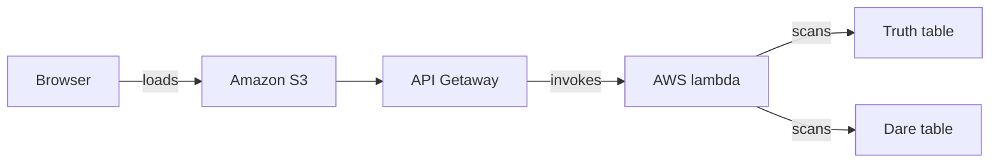

# Truth or Dare

## About
A tiny party game: pick **Truth** or **Dare** and get a random challenge that
you'll never see twice (per category) until you've seen them all.


## Project layout
```
truth-or-dare/
├── frontend/                    #UI
│   ├── index.html
│   ├── style.css
│   └── script.js
├── backend/                     #logic
│   ├── lambda_function.py  
│   └── challenge_logic.py
│   └── seed_lambda_function.py  #contains the truth and dare challenges
├── tests/
│   └── test_challenge_logic.py
└── SETUP_GUIDE.md
```


## AWS Services used

- Lambda
- DynamoDB
- API Gateway
- CloudWatch
- IAM


## Project Architecture




## Deploying to AWS

Read `SETUP_GUIDE.md` to set it up yourself